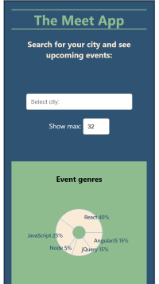
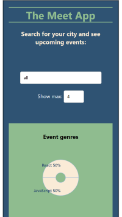

# meet

**meet** is a serverless, progressive web application (PWA) with React using a test-driven development (TDD) technique. The application uses the Google Calendar API to fetch upcoming events.

## Built with:
- HTML, CSS, JavaScript
- React
- AWS Lambda
- Serverless
- Google Calendar API
- OAuth2
- Recharts data visualization

## Key features:
- Filter events by city
- Show/hide event details
- Specify number of events
- Use the app when offline
- Add an app shortcut to the home screen
- View a chart showing the number of upcoming events by city

    
    
    

    
    
    

---
# User stories and scenarios
---

### **Feature 1: Filter events by city**

*User story: 
    As a user
    I should be able to “filter events by city”
    so that I can see the list of events that take place in that city.*

    Scenario 1: When user hasn’t searched for a city, show upcoming events from all cities.
		Given user hasn’t searched for any city
		When the user opens the app
		Then the user should see a list of all upcoming events

    Scenario 2: User should see a list of suggestions when they search for a city.
		Given the main page is open
		When user starts typing in the city textbox
		Then the user should see a list of cities (suggestions) that match what they’ve typed

    Scenario 3: User can select a city from the suggested list.
		Given the user was typing “Berlin” in the city textbox, And the list of suggested cities is showing
		When the user selects a city (e.g., “Berlin, Germany”) from the list
		Then the city should be changed to that city, And the list of suggestions should disappear, And the user should see a list of upcoming events in that city

### **Feature 2: Show/hide an event's details**

*User story: 
    As a user
    I should be able to show/hide an event's detail,
    so that I can control which details I am shown.*

	Scenario 1: An event element is collapsed by default.
        Given user hasnt searched for any city
        When the user opens the app
        Then all resulting elements should be collapsed by default

    Scenario 2: User can expand an event to see its details.
        Given the user has started a search
        When the user clicks on the 'show details' button
        Then the user should see the details
        
    Scenario 3: User can collapse an event to hide its details.
        Given the user has opened an events' details
        When the user clicks the 'hide details' button
        Then events' details should collapse

### **Feature 3: Specify number of events**

*User story: 
    As a user
    I should be able to specify the number of events
    so that the number of shown events is limited.*

	Scenario 1: When user hasnt specified a number, 32 is the default number.
        Given the user has started a search
        When the users did not specify a number
        Then 32 should be the default number
	
Scenario 2: User can change the number of events they want to see.
        Given the user has started a search
        When the user enters a number into the 'show max' field
        Then the number of listed events should update accordingly

### **Feature 4: Use the app when offline**

*User story: 
    As a user
    I should be able to use the app when offline
    so that I still see my search results when the connection is down.*

	Scenario 1: Show cached data when there’s no internet connection
		Given the user starts the app,
		When there’s no internet connection,
		Then the user should see cached data

	Scenario 2: Show error when user changes the settings (city, time range)
		Given there's no internet connection,
		When the user changes the settings,
		Then an error should be shown

### **Feature 5: Data visualization**

*User story: 
    As a user
    I should be able to visualize data
    so that I see a chart with the number of upcoming events in each city.*

	Scenario 1: Show a chart with the number of upcoming events in each city
		Given the user has started the app,
		When the user has not started a search yet,
		Then the user should see a chart with the number of upcoming events in each city